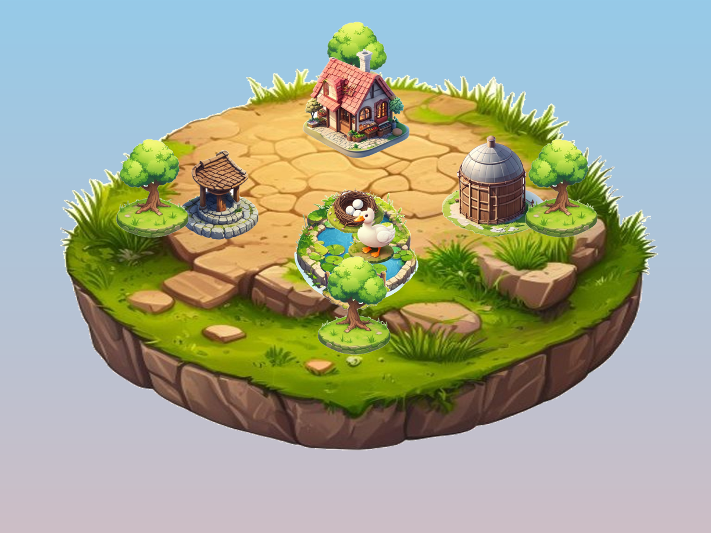

# Geese Gone Galactic (v3)

*A played pond rendered by the game — real painterly art (`render` → `game/art_view.py`), composited from
free image-model sprites (`ops/generate_art.py`) by the game's own state.*

A strict, self-improving **harness** that bootstraps a local AI *agent* (**Icarus**, on Ollama) and uses
it to build the game — logic *and* visuals — with every piece held to an un-gameable quality gate. The
game's look is **generated cozy-game art** (a floating island of cottages, geese and trees); the older
low-poly Godot view is kept as `render3d`. Pond era only.

**Icarus built a real, playable game.** The "One Pond" core is **28 agent-authored Python modules**
(`game/pond/`) — a granary-synergy bread economy, placement, simulation, predator safety, water access, a
layered win/lose outcome, score + rank progression, a hint system, dynamic events, a goose population,
planning/affordability helpers, a text-command interface, and save/load — composing into a guided game,
plus **five agent-built Godot scenes** (`game/godot/scenes/`, culminating in the complete world with
geese). Every module was produced by the local agent through the gate and is behaviour-locked by a test.
Icarus's gate-passing solutions are also captured as self-distillation training data (`data/*_sft.jsonl`,
see `docs/DISTILL.md`) to raise its unaided capability.

**Play it in your browser:** `python ops/play_web.py` → open `http://localhost:8770` — click **Build
Bakery / Granary / Nest / Well / Fence / Tick** and watch your cozy island grow as **real painterly art**.
(Or the text game: `python ops/play_commands.py --interactive` — `build bakery`, `tick`, `status`,
`render pond.png` for the art, `render3d` for the older 3D view, `save`/`load`, `quit`; or
`python ops/play_onepond.py` for a scripted guided pond.)

**The art** is generated free by an image model (`ops/generate_art.py` → `assets/art/`) — the game's look is
real cozy-game illustration, not primitive shapes.

- Honest capability: the full authored backlog commits **11/11 at autonomy 1.0** through the hardened gate,
  unattended; unaided-logic sits in a ~0.73–0.85 band (see `docs/SCORECARD.md`).
- Read `docs/HANDOFF.md` first (self-resuming status), then `docs/PLAN.md` (architecture),
  `game/pond/README.md` (the game core), `docs/ICARUS_CHANGELOG.md` (measured capability history).

Commit authority lives ONLY in `harness/gatekeeper.py`. The archived Unity v1/v2 lives separately and is
not built upon.
